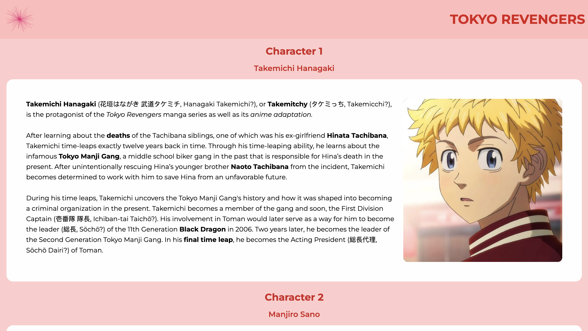

# Tokyo Revengers - Characters

> The title Tokyo Revengers and the in-universe organization's name called the Tokyo Manji Gang both consist of the left-facing swastika (卍) called manji in Japanese. It is a reference to Japanese Buddhism, which the Tokyo Manji Gang is grounded in, and symbolizes power and good fortune in different religions including Jainism and Hinduism, as well as other European and Native American religions.

[Tokyo Revengers](https://tokyo-revengers-characters.netlify.app/)

